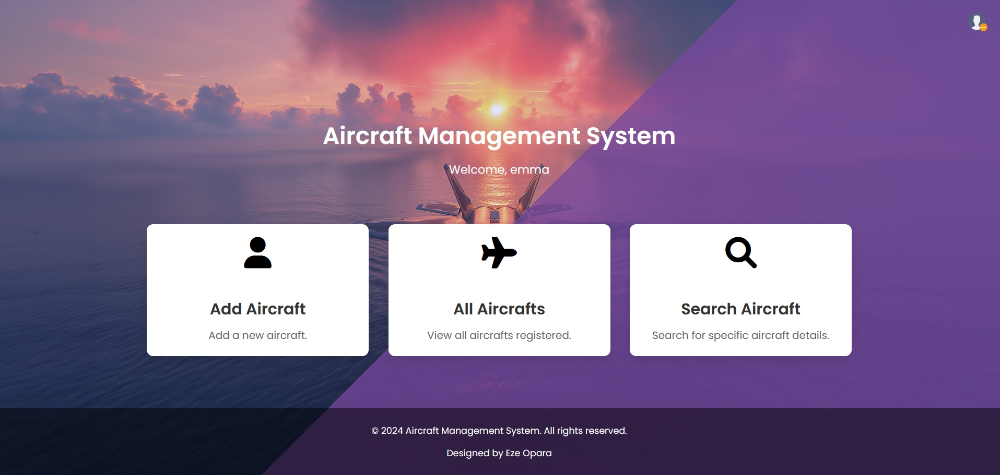

# AircraftManagementSystem
This is a simple web application to help the Nigerian Air Force's flight  school manage their trainer aircraft by keeping track of maintenance routines carried out by engineers. This is designed with Nodejs, Firebase, and Express. 
the web page is hosted on render.com with the URL  https://aircraftmanagementsystem.onrender.com

